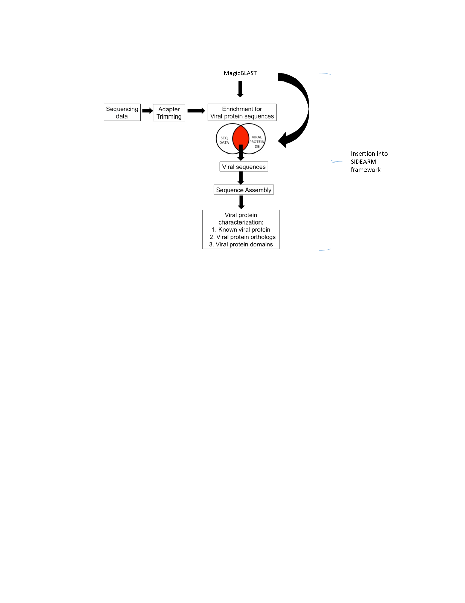

# VirusFrankenstein

## Graphical Overview:



## Overview:

A project that will make Virome Sniff read directly from SRA i.e. given an input SRA dataset, Virus Frankenstein will output which viruses are likely to be in the SRA dataset. 
* Virome Sniff searches NGS reads using virus protein database, and finds known viral sequence and protein domains. 
* Sidearm detects viral sequences in SRA datasets using MagicBLAST.

## Usage:

1. The following commands will download the Zika virus genome and uncompress it. Using the Zika virus genome, a Zika Virus BLAST database will be created with makeblastdb. Then the local directory will be added to the BLASTDB environmental variable.

* This example uses an RNA-seq dataset (SRR5675890) from a Zika virus outbreak. After cloning this repository, do the following:

```wget ftp://ftp.ncbi.nlm.nih.gov/genomes/all/GCF/000/882/815/GCF_000882815.3_ViralProj36615/GCF_000882815.3_ViralProj36615_genomic.fna.gz```

```gunzip GCF_000882815.3_ViralProj36615_genomic.fna.gz```

```makeblastdb -dbtype nucl -in GCF_000882815.3_ViralProj36615_genomic.fna -out zikavirus -parse_seqids```

```export BLASTDB=${BLASTDB}:${PWD}```

2. MagicBLAST into the virus database created, and extract the viral sequences. 


